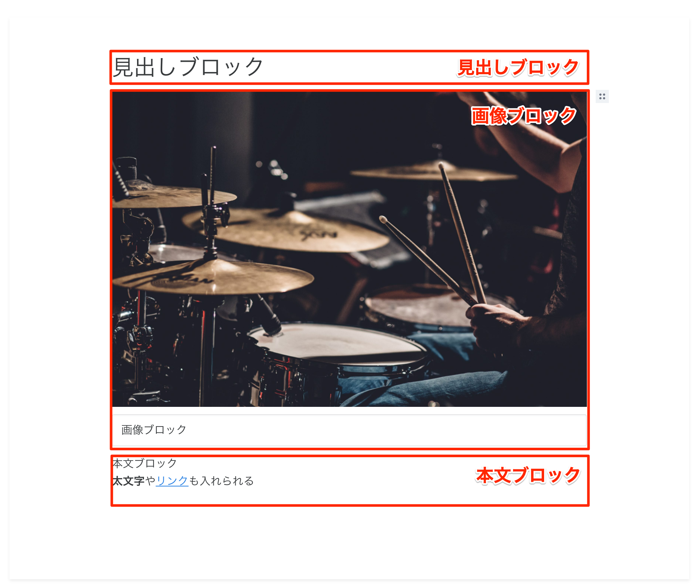
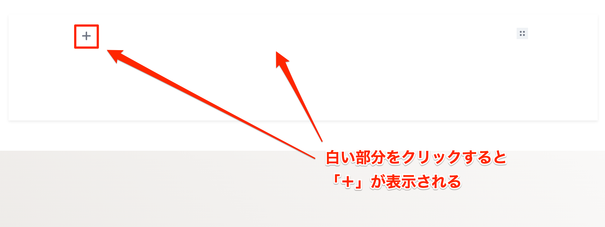
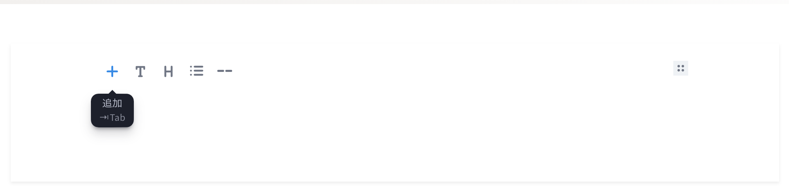
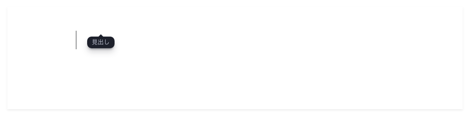

# ブロッグ型エディタの使い方

ブロック型エディタとは、その名のとおり、ブロックを積み重ねるようにページを作成する編集機能です。  
たとえば、「見出し」「画像」「本文」という構成のページを作成する場合は、次のようにブロックを配置します。



これにより専門知識がなくても、だれでも簡単にページを作成することができます。

音箱のブロック型エディタで対応しているブロックは次のとおりです。

- 段落
- 見出し
- リスト
- 罫線
- 画像
- 動画（YouTube, Vimeo）

画像や動画はURLを貼るだけで表示されます。  
※アップロードには対応しておりません。

## ブロックを追加する

ブロックを追加する手順は次のとおりです。

1. エディタの空白部分をクリック
1. 左側に表示された `＋` をクリック
1. 挿入したいブロックを種類を選択

エディタの白い部分をクリックすると、左側に `＋` が表示されます。



この `＋` をクリックすると、ブロックアイコンが表示されますので、挿入したいブロックをクリックしてください。



アイコンの種類は左から次のとおりです。

- 段落
- 見出し
- リスト
- 罫線

```{note}
画像と動画の追加手順はそれぞれ、 `画像を追加する`、 `動画を追加する` のページで説明します。
```

アイコンをクリックするとカーソルが表示されますので、挿入したい内容を入力してください。



```{note}
ブロックアイコンを選択しないまま入力した場合は、段落ブロックとして扱われます。
```
