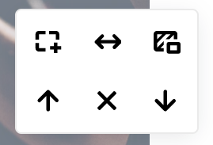

# 画像を追加する

## 画像ブロックを追加する

画像のブロックは、通常のブロックとは異なる方法で追加します。  
追加する手順は次のとおりです。

1. エディタの空白部分をクリック
1. 画像のURLを貼り付ける

これだけで画面上に表示されます。

[](https://gyazo.com/47ce7bfa0f89154f1d1aef080c9c39bf)

画像ブロックには、キャプションを入力する欄も追加されます。画像の説明があればこちらに入力してください。


```{note}
画像はあらかじめインターネット上でアクセスできる場所にアップロードしてください。
```

## 画像の装飾表示

画像ブロックでは、画像の表示を装飾することができます。  
装飾の種類は次のとおりです。

- 枠線付き表示
- 全幅表示
- 背景色付き表示

これらは組み合わせることもできます。

### 装飾方法

追加した画像ブロックをクリックすると、ブロックの右上あたりにメニューアイコンが表示されます。


このアイコンをクリックして、メニューを開いてください。


### 枠線付き表示

枠線付き表示は、メニューの一番左にあるアイコンをクリックします。


クリックしたアイコンの色が変わり、画像に枠線が付きます。


実際の表示は次のとおりです。


画像の周りにうっすらと線が表示されています。

### 全幅表示

全幅表示は、メニューの真ん中にあるアイコンをクリックします。


クリックしたアイコンの色が変わり、画像が画面幅いっぱいに表示されます。


実際の表示は次のとおりです。


画像が画面幅いっぱいに表示されました。

### 背景色付き表示

背景色付き表示は、メニューの一番右にあるアイコンをクリックします。


クリックしたアイコンの色が変わり、画像が少し小さく表示されて背景に色がつきます。


実際の表示は次のとおりです。


画像の背景に色がつきました。

```{note}
背景の色は固定です。指定はできません。
```

### 装飾を組み合わせる

画像の装飾は組み合わせて使用することができます。  
次の表示は `枠線付き表示` と `背景色付き表示` を組み合わせた例です。


画像の背景に色がつき、その周りに枠線がつきました。

### 装飾を外す

装飾が適用されている場合は、メニューにあるアイコンの色が変化しています。


外したい装飾のアイコンをクリックすると、元の色に戻り、装飾が削除されます。


