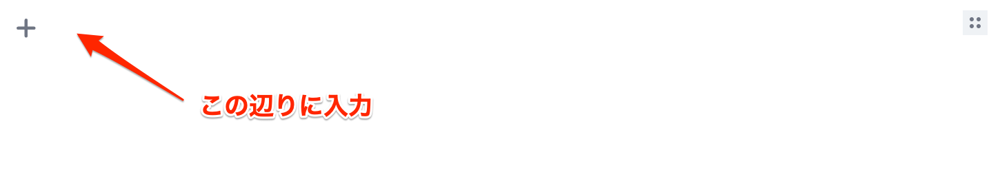
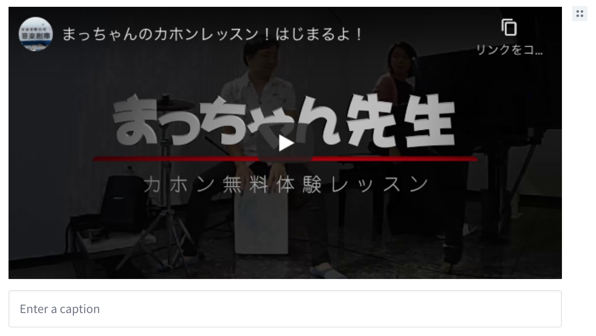
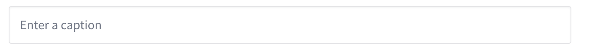

# 動画を追加する

## 動画ブロックを追加する

動画のブロックは、通常のブロックとは異なる方法で追加します。  
追加する手順は次のとおりです。

1. エディタの空白部分をクリック
1. 動画のURLを入力

これだけで画面上に表示されます。



↓



動画ブロックには、キャプションを入力する欄も追加されます。動画の説明があればこちらに入力してください。



```{note}
動画は YouTube のみ対応しています。 `https://www.youtube.com/watch?v=` から始まる文字列を入力してください。
```
