# 講師として登録する

## 講師登録を申請する

レッスンを開講するためには、講師として登録する必要があります。
講師登録はアカウント設定より行えます。

ログインしている状態で上部に表示される自分のアイコンをクリックすると操作メニューが表示されます。操作メニューの中にある `アカウント設定` をクリックしてください。

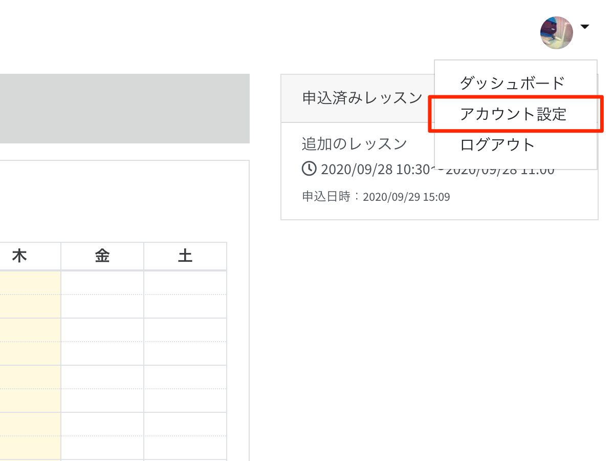

アカウント設定の画面が表示されます。

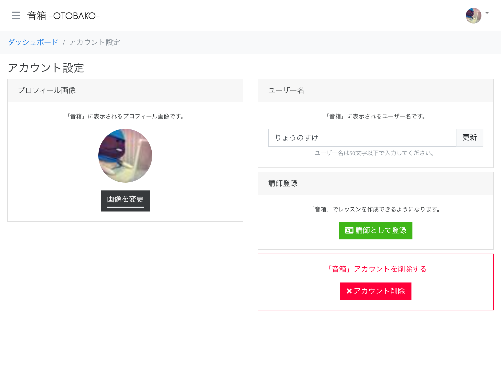

講師登録を行っていない場合は、アカウント設定の画面内に `講師として登録` ボタンが表示されます。このボタンをクリックしてください。

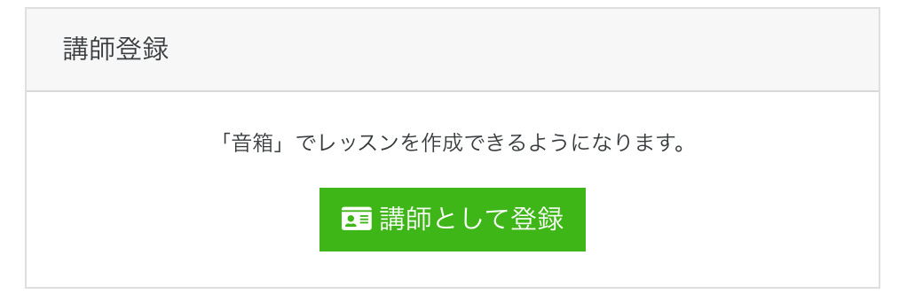

「講師登録を申請しますか？」という確認メッセージが表示されますので、`OK` を選択してください。

### 本人確認

金銭の授受が発生するため講師登録の際は本人確認をさせていただきます。本人確認ができない場合は、受講料のお支払いができないことがありますのでご了承ください。

本人確認書類としてご利用可能なものは次のとおりです。

- パスポート
- 運転免許証
- 在留カード・特別永住者証明書
- マイナンバーカード (顔写真付き)
- 住民基本台帳カード (顔写真付き)/住基カード (顔写真付き)

```{note}
本人確認は決済会社の Stripe に委託しておりあす。提供いただいた個人情報は音箱では保持せず、Stripe により安全に管理されます。
```

Stripe による本人確認フォームです。後ほど本人確認書類の提出がありますので、お間違いのないよう入力してください。

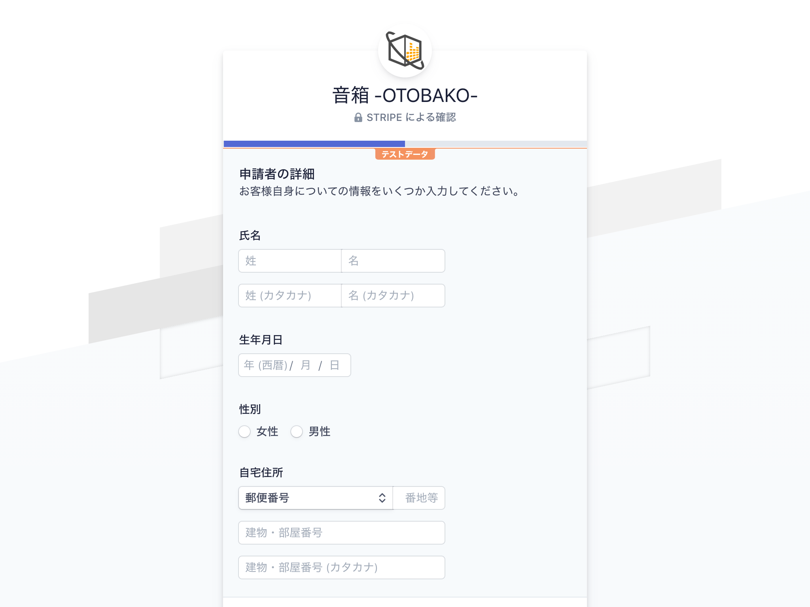  
※画面は開発中のものです。実際と異なる場合があります。

すべて入力して【完了】をクリックすると、次のような画面に切り替わります。

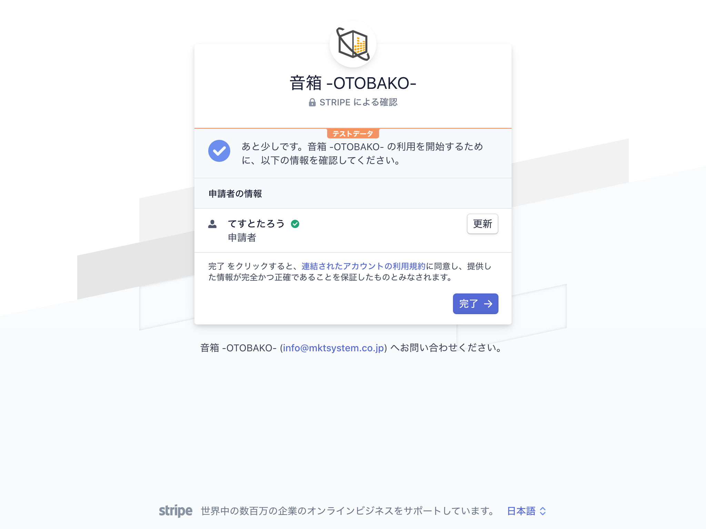  
※画面は開発中のものです。実際と異なる場合があります。

入力内容に不備があるあ場合は次のように表示されますので、【更新】のボタンを押して見直してください。

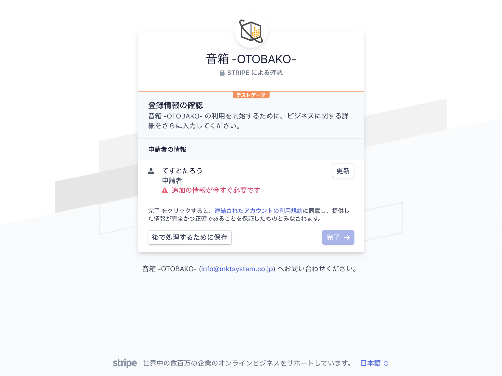  
※画面は開発中のものです。実際と異なる場合があります。

フォームの送信が完了すると、一旦、音箱サービスの画面に移動します。

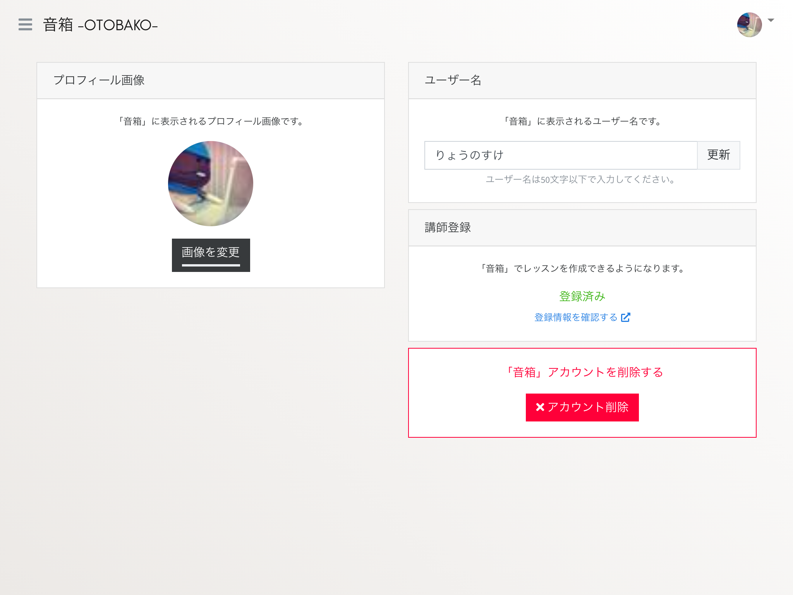  
※画面は開発中のものです。実際と異なる場合があります。

この時点で講師登録が行われますが、受講料の受け取りができません。  
つづいて本人確認書類の提出を行ってください。

講師登録が行われると、講師登録の項目が `登録済み` に変わります。登録した内容はその下にある `登録内容を確認する` リンクから確認が行えます。

本人確認書類の提出もこちらから行いますので、クリックしてください。

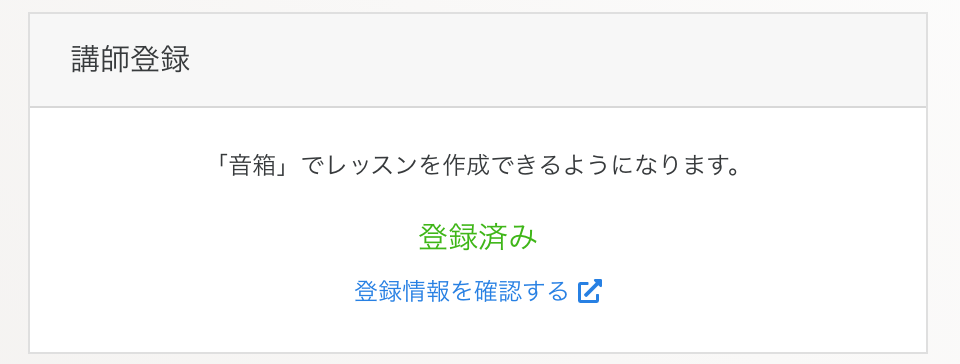

登録情報の確認画面が表示されます。【更新】ボタンをクリックしてください。

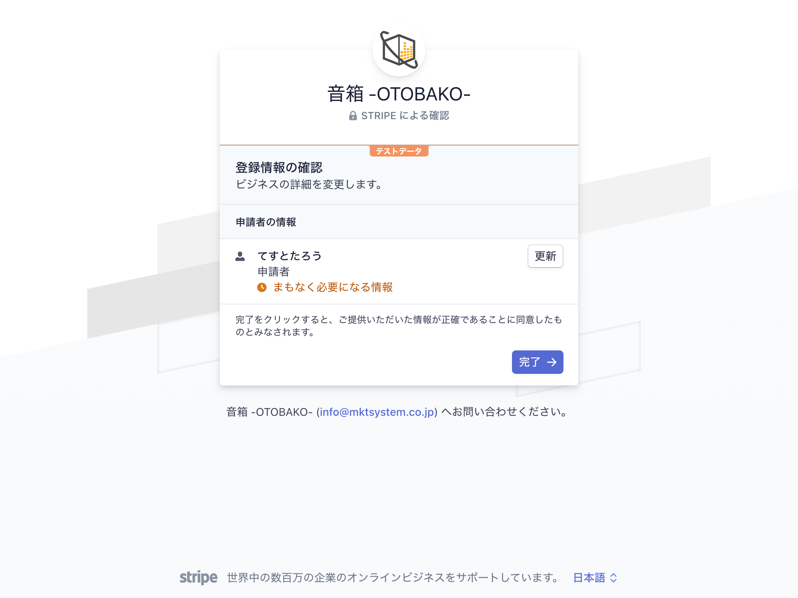  
※画面は開発中のものです。実際と異なる場合があります。

さきほど完了したフォームが表示されます。

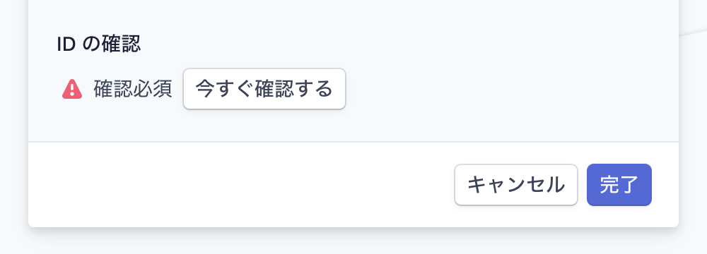  
※画面は開発中のものです。実際と異なる場合があります。

フォームの一番下に `IDの確認` という項目が追加されています。【今すぐ確認する】ボタンを押して、画面の指示に従い本人確認書類を提出してください。

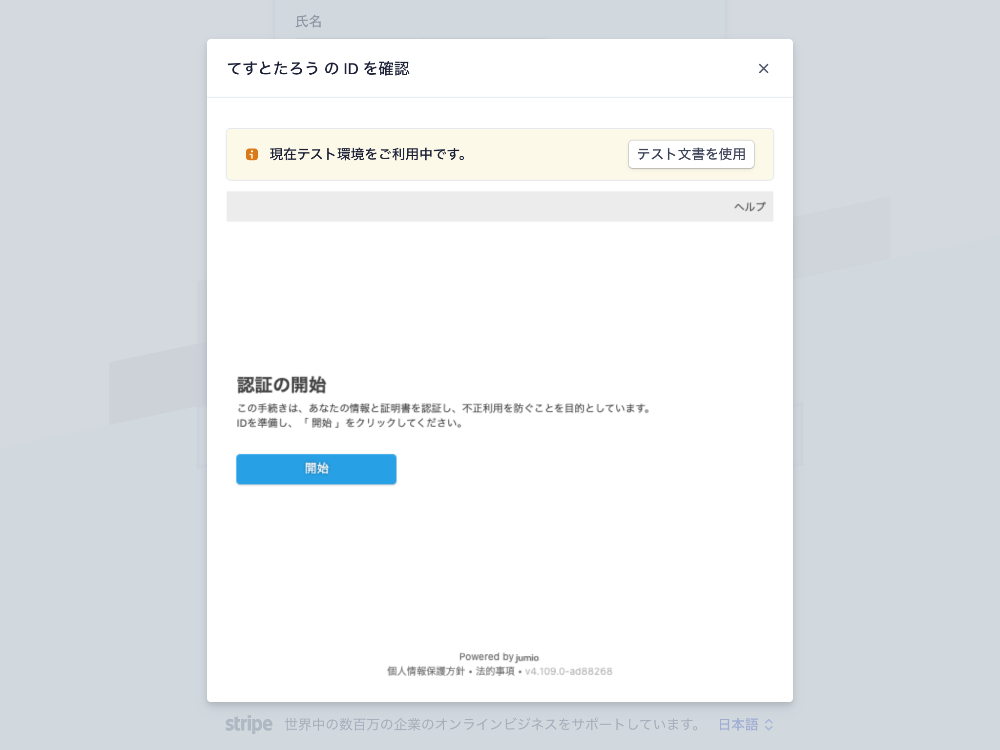  
※画面は開発中のものです。実際と異なる場合があります。

これで講師登録が完了です。レッスンを作成して受講者を増やしましょう！

## マイページを作成する

講師登録が完了すると、マイページが持てるようになります。マイページとは、ご自身の得意なことや教えられる楽器などをわかりやすく説明するためのページです。動画や画像を使って、存分にアピールしてください。

ログインしている状態で上部に表示される自分のアイコンをクリックすると操作メニューが表示されます。操作メニューの中にある `マイページ編集` をクリックしてください。

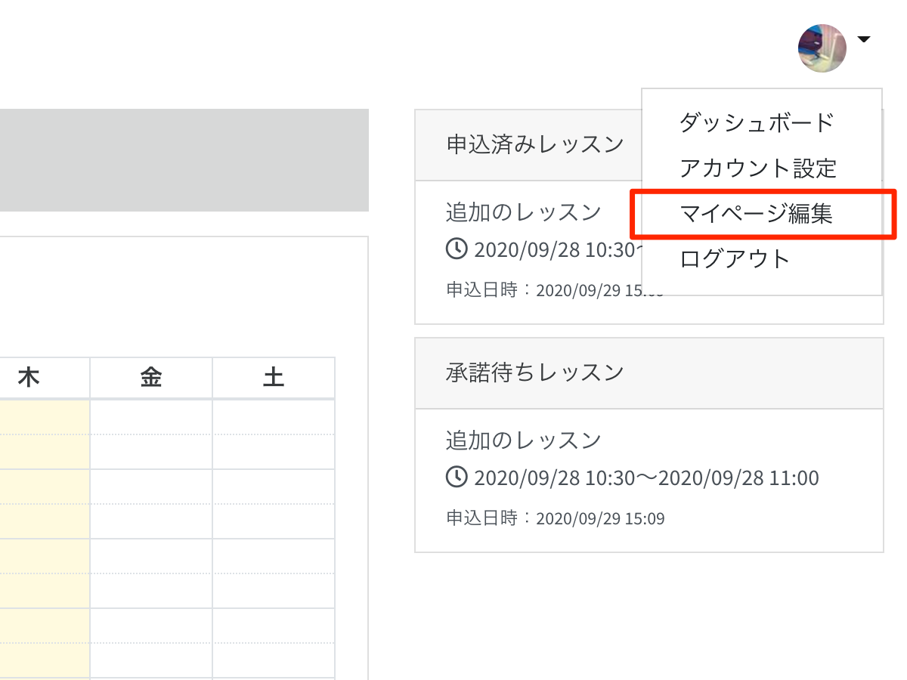

マイページ編集の画面が表示されます。

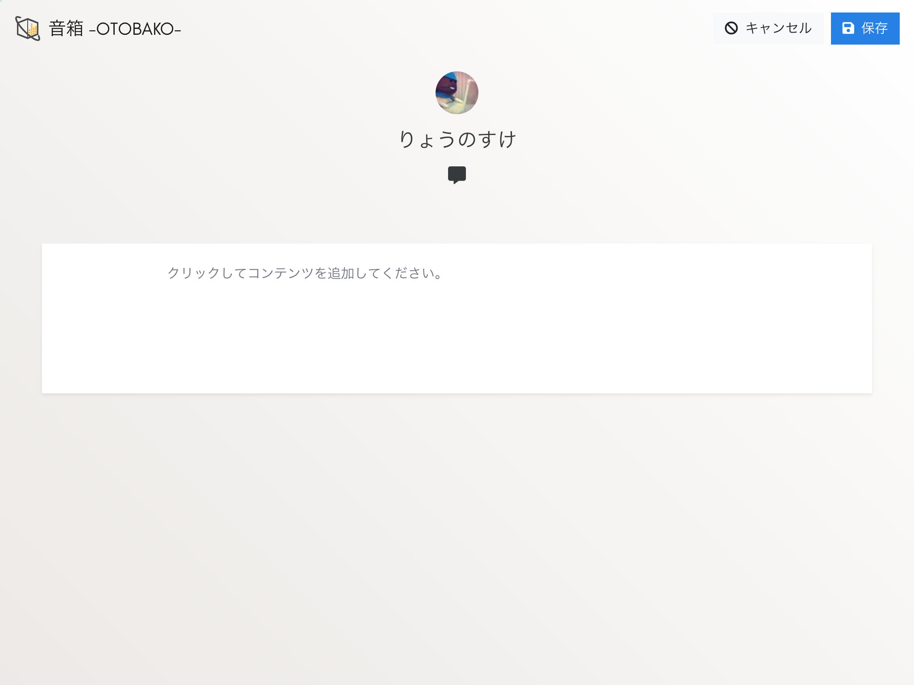

マイページでは、ブロック型エディタで自由にコンテンツを追加することができます。対応しているコンテンツは次のとおりです。

- 段落
- 見出し
- リスト
- 罫線
- 画像
- 動画（YouTube, Vimeo）

画像や動画はURLを貼るだけで表示されます。  
※アップロードには対応しておりません。

コンテンツの追加方法は、「[ブロック型エディタの使い方](editor)」のページをご覧ください。

保存をすると、講師のマイページとして公開されます。

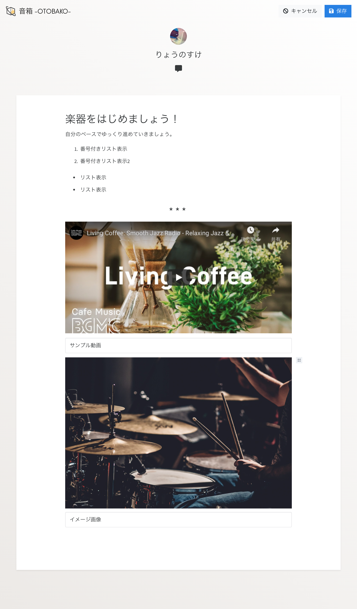
