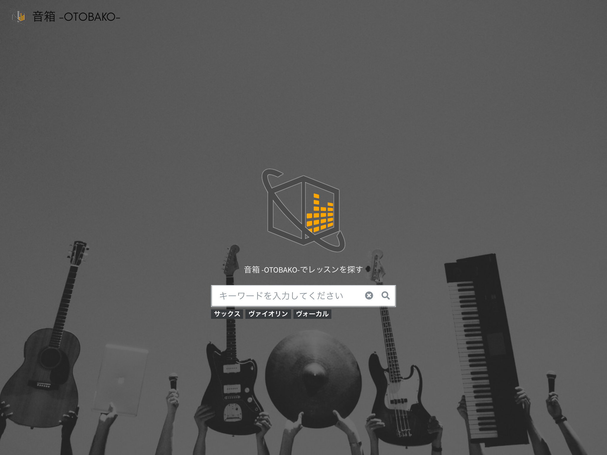
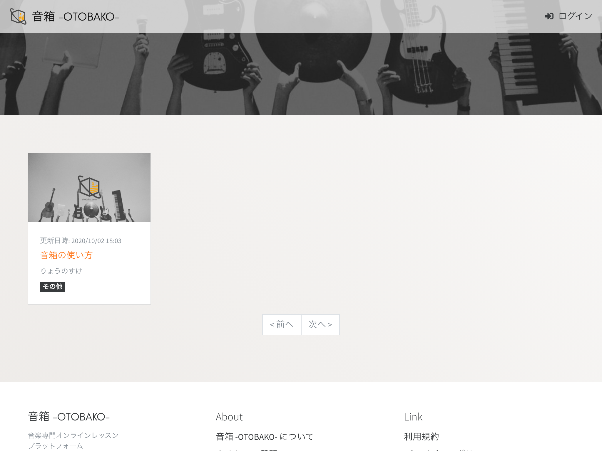
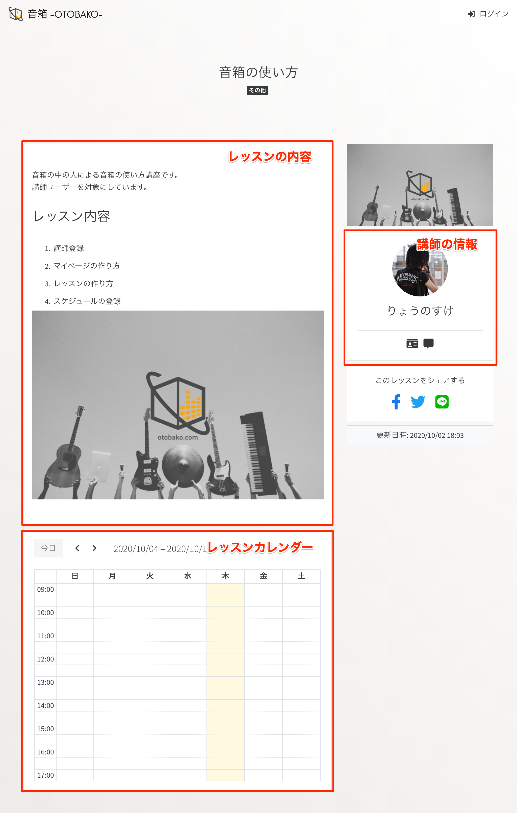
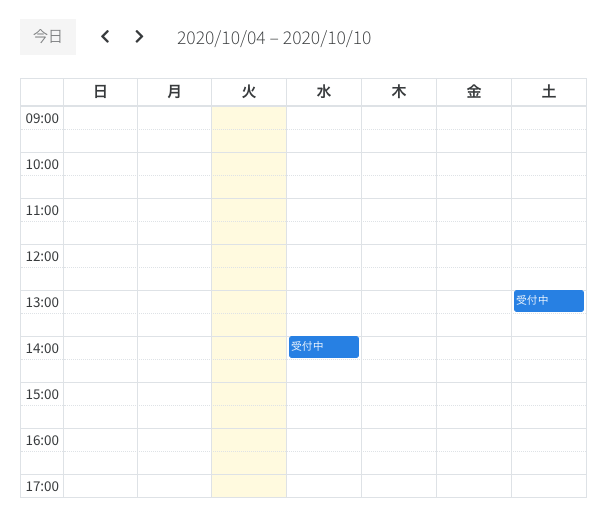
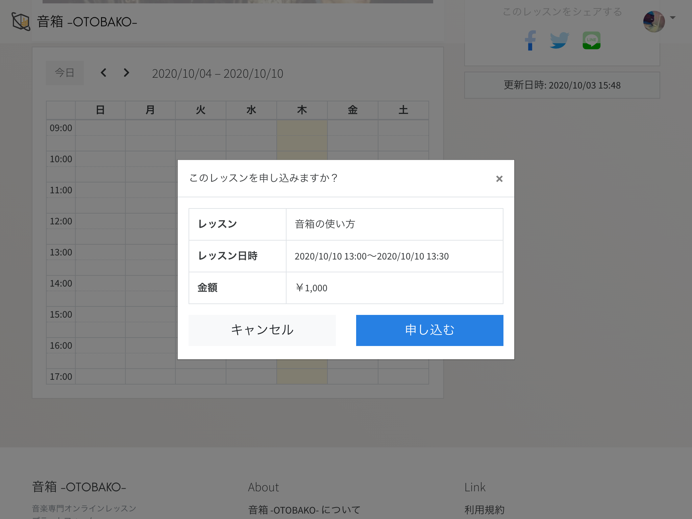
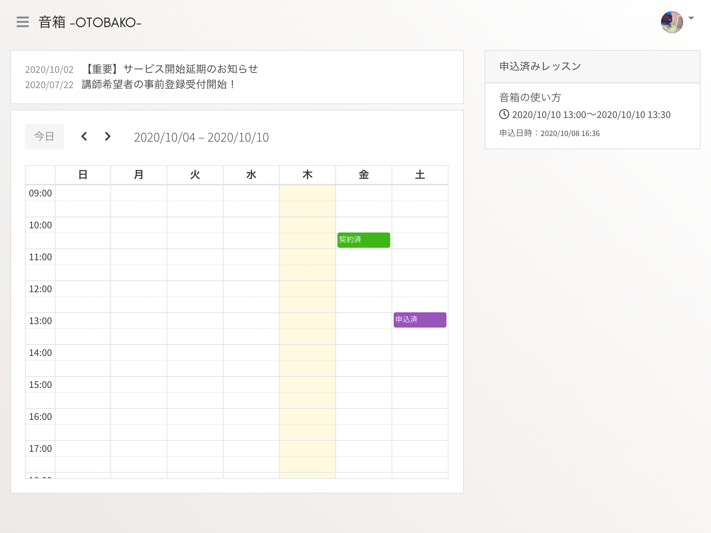
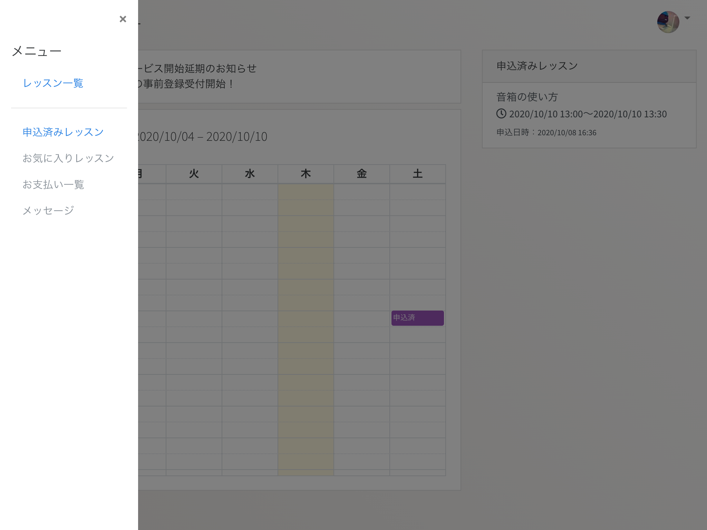
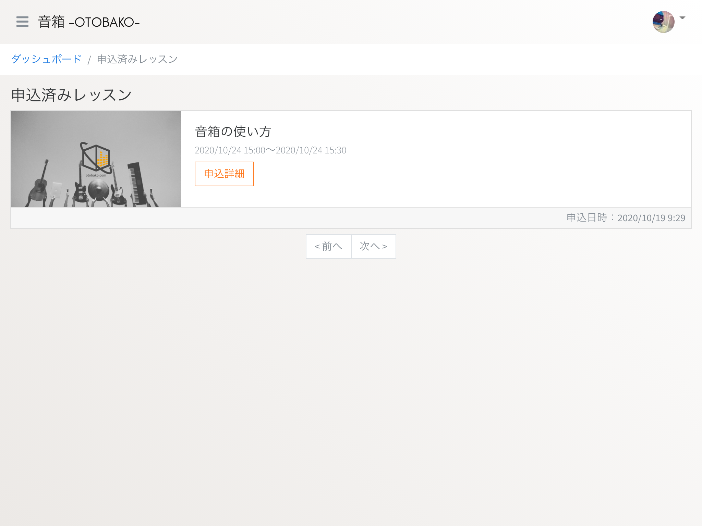
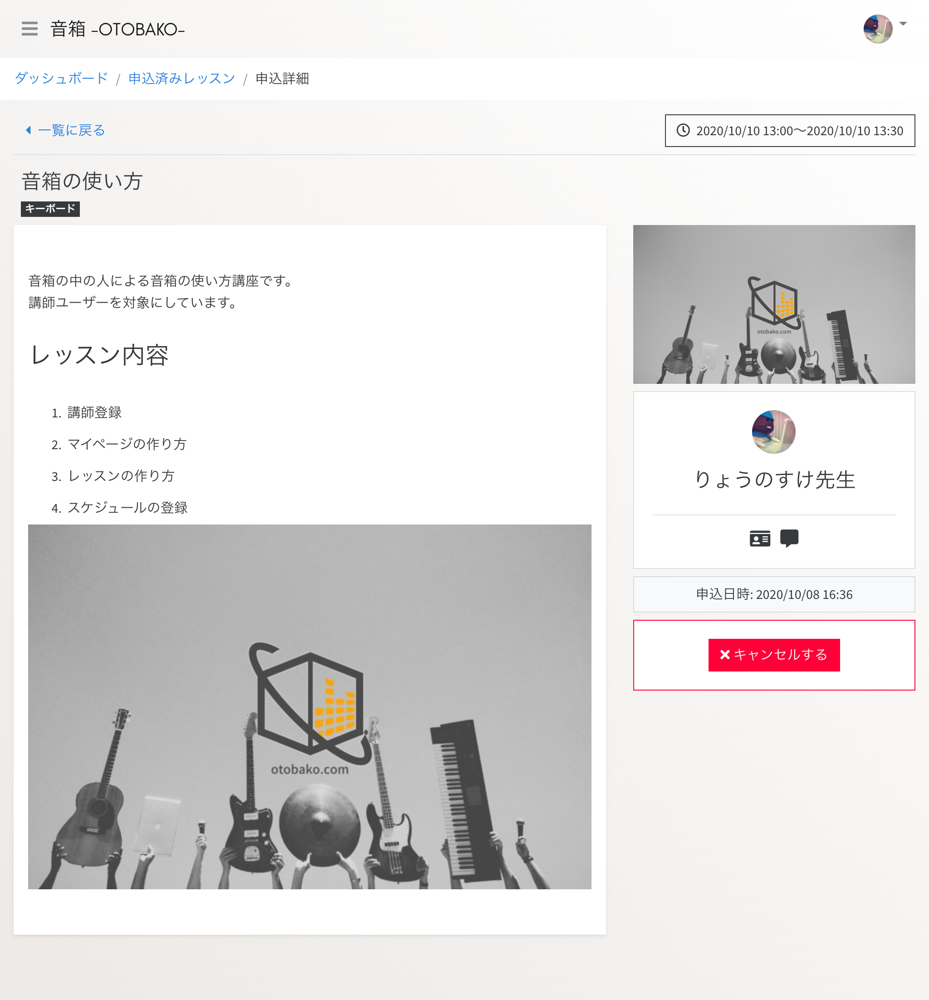
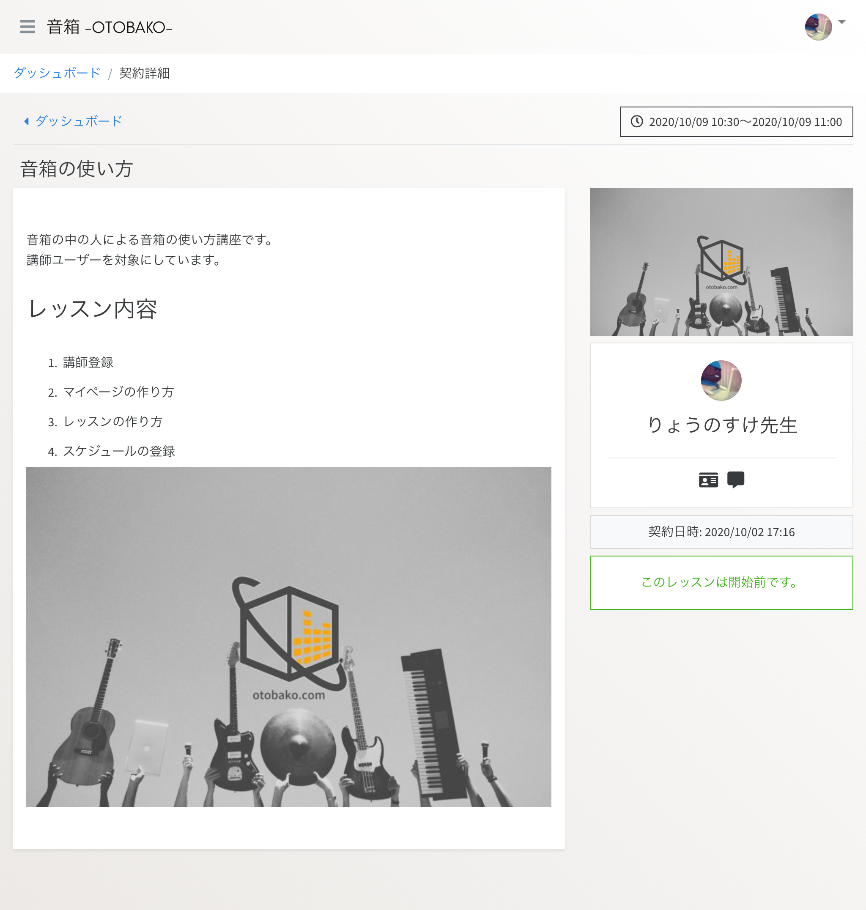

# レッスンを受講する

音箱でレッスンを受講する手順は次のとおりです。

1. レッスンを探す
1. スケジュールを確認する
1. 日時を選択して申し込む
1. 講師の承諾
1. 料金のお支払い（*）
1. レッスンを受講する

(*) β版では決済機能はご利用いただけません。

## レッスンを探す

公開されているレッスンは一覧画面にすべて表示されます。レッスンタイトル、レッスンタグで絞り込みが行えます。

トップページ



レッスン一覧



気になるレッスンを見つけたらレッスンの画像、または、レッスンのタイトルをクリックして詳細を確認してください。

## スケジュールを確認する

レッスン詳細画面には、次の情報が表示されます。

- レッスンの内容
- レッスンカレンダー
- 講師の情報



レッスンのスケジュールはレッスンカレンダーに表示されます。



- 受付中 （ブルー）
- 契約済 （グレー）

`受付中` が現在レッスンを受け付けている日時になります。

## 日時を選択して申し込む

レッスンカレンダーに表示された `受付中` をクリックすると申し込み確認が表示されます。



`申し込む` をクリックすることで、申し込みが完了します。申し込みをしたレッスンは `ダッシュボード` および `申込済みレッスン一覧` よりご確認いただけます。



### 申込済みレッスンを確認する

画面左上のハンバーガーメニューをクリックしてください。


画面左側にメニューリンクが表示されます。



メニューの中にある『申込済みレッスン』をクリックすると、申込済み一覧画面に移動します。



一覧の中の `申込詳細` ボタンをクリックするとレッスンの内容を確認することができます。



## 講師の承諾

申し込みが完了すると、講師の承諾を待つことになります。  
講師が承諾すると『申込済みレッスン一覧』から削除され、レッスンを受けるための画面（契約詳細画面）にアクセスできるようになります。

```{tip}
講師の承諾が得られるまでは、いつでも申し込みをキャンセルすることができます。
```

## 料金のお支払い

β版では決済機能はご利用いただけません。

## レッスンを受講する

契約したレッスンはダッシュボードのカレンダーに表示されます。


`契約済` （グリーン）をクリックすると契約詳細画面に移動し、レッスンの内容が確認できます。



受講日時になると画面下部に `レッスン開始` ボタンが表示されますので、クリックしてレッスンを受講してください。

開始前  


受講時間  

