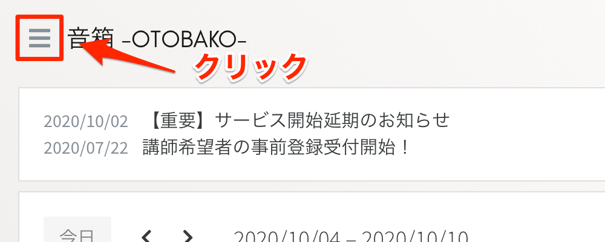
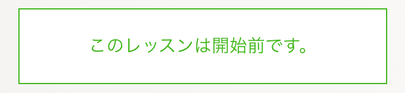

# レッスンを受講する

音箱でレッスンを受講する手順は次のとおりです。

1. レッスンを探す
1. スケジュールを確認する
1. 日時を選択して申し込む
1. 講師の承諾
1. 料金のお支払い
1. レッスンを受講する

## レッスンを探す

公開されているレッスンは一覧画面にすべて表示されます。レッスンタイトル、レッスンタグで絞り込みが行えます。

トップページ


レッスン一覧


気になるレッスンを見つけたらレッスンの画像、または、レッスンのタイトルをクリックして詳細を確認してください。

## スケジュールを確認する

レッスン詳細画面には、次の情報が表示されます。

- レッスンの内容
- レッスンカレンダー
- 講師の情報


レッスンのスケジュールはレッスンカレンダーに表示されます。


- 受付中 （ブルー）
- 契約済 （グレー）

`受付中` が現在レッスンを受け付けている日時になります。

## 日時を選択して申し込む

レッスンカレンダーに表示された `受付中` をクリックすると申し込み確認が表示されます。


`申し込む` をクリックすることで、申し込みが完了します。申し込みをしたレッスンは `ダッシュボード` および `申込済みレッスン一覧` よりご確認いただけます。


### 申込済みレッスンを確認する

画面左上のハンバーガーメニューをクリックしてください。



画面左側にメニューリンクが表示されます。


メニューの中にある『申込済みレッスン』をクリックすると、申込済み一覧画面に移動します。


一覧の中の `申込詳細` ボタンをクリックするとレッスンの内容を確認することができます。


## 講師の承諾

申し込みが完了すると、講師の承諾を待つことになります。  
気になることがあれば、事前にメッセージなどで講師に問い合わせをしてください。

```{tip}
講師の承諾が得られるまでは、いつでも申し込みをキャンセルすることができます。
```

```{admonition} 注意事項
:class: warning
講師の承諾が完了した段階で受講契約が成立し、受講料を支払う義務が発生します。
```

## 料金のお支払い

講師の承諾が完了すると『申込済みレッスン一覧』から削除され、 `ダッシュボード` の『未払いレッスン』に表示されます。
お支払いは**レッスン日の開始前まで**に行ってください。


『未払いレッスン』をクリックすると、レッスンの内容を確認することができます。


画面右下あたりにお支払いのボタンが表示されます。


お支払いはクレジットカードのみとなります。
対応するカードのブランドを表示していますので、ご確認の上お支払い処理に進んでください。


お支払いのボタンをクリックすると、カード情報を入力するフォームが表示されます。
カード番号、カードの利用期限年月、セキュリティコードを入力してください。

```{note}
音箱では**クレジットカード情報を保存することはありません**。決済に関する情報は決済会社の Stripe に委託しております。いただいた個人情報は音箱では保持せず、Stripe により安全に管理されます。
```


お支払いが完了すると、未払いレッスンから情報が消えて、`契約済` に変わります。

## レッスンを受講する

契約したレッスンはダッシュボードのカレンダーに表示されます。


`契約済` （グリーン）をクリックすると契約詳細画面に移動し、レッスンの内容が確認できます。


受講日時になると画面下部に `レッスン開始` ボタンが表示されますので、クリックしてレッスンを受講してください。

開始前  


受講時間  

