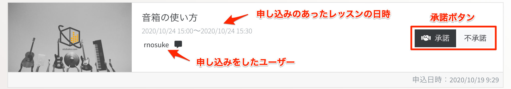
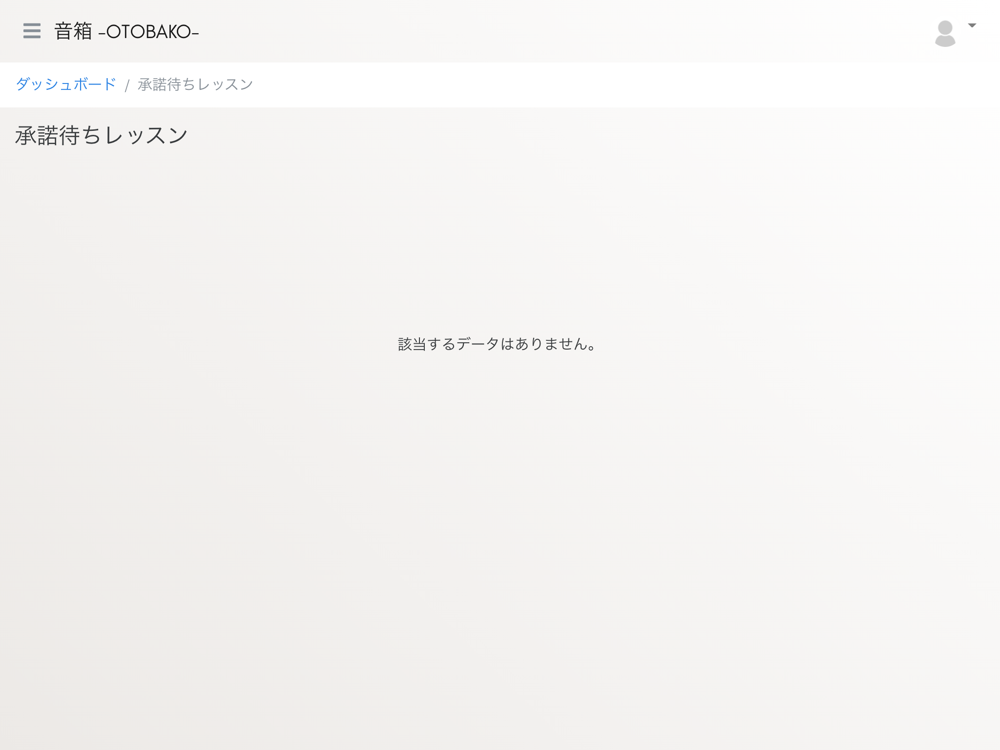

# レッスンを実施する

音箱でレッスンの申し込みを受けて実施する手順は次のとおりです。

1. 申し込みを受ける
1. 申し込みを承諾する
1. お支払いを確認する
1. レッスンを実施する

## 申し込みを受ける

レッスンのスケジュールを追加すると、公開画面のレッスンカレンダーにも表示されるようになります。


受講希望者はこのレッスンカレンダーから希望の日時を選択して申し込みを行います。


## 申し込みを承諾する

スケジュールに対して申し込みがあると、ダッシュボードや承諾待ち一覧画面に情報が表示されます。


ダッシュボードまたは、左メニューにある `承諾待ちレッスン` をクリックしてください。承諾待ちレッスン一覧画面に移動し、申し込みを受けた内容が一覧で表示されます。


内容の詳細は次のとおりです。



`承諾` ボタンをクリックすると、より細かな情報が表示されます。


申し込みの内容に問題がなければ、 `承諾する` をクリックしてください。



承諾待ちレッスンから情報が消え、受講希望者のお支払いを待つことになります。

```{admonition} 注意事項
:class: warning
この段階で受講契約が成立し、レッスン内容に従って実施する義務が発生します。レッスン内容や日時など、再度確認した上で承諾してください。
```

## お支払いを確認する

画面左上のハンバーガーメニューをクリックしてください。


画面左側にメニューリンクが表示されます。


メニューの中にある『支払い待ちレッスン』をクリックすると、支払い待ちレッスン一覧画面に移動します。


承諾したレッスンのうち、お支払いがされていないレッスンの情報を確認することができます。

```{admonition} 注意事項
:class: warning
お支払いはレッスン当日の開始時間前まで可能です。期日を過ぎた場合は受講生都合によるキャンセル扱いになります。メッセージなどを利用して、まめに連絡を取るようにしてください。
```

受講希望者のお支払いが完了したレッスンの情報は『契約済レッスン一覧』に表示されます。


## レッスンを実施する

契約したレッスンはダッシュボードのカレンダーに表示されます。


`契約済（講師）` をクリックすると契約詳細画面に移動し、レッスンの内容が確認できます。


受講日時になると画面下部に `レッスン開始` ボタンが表示されますので、クリックしてレッスンを受講してください。

開始前  


受講時間  

