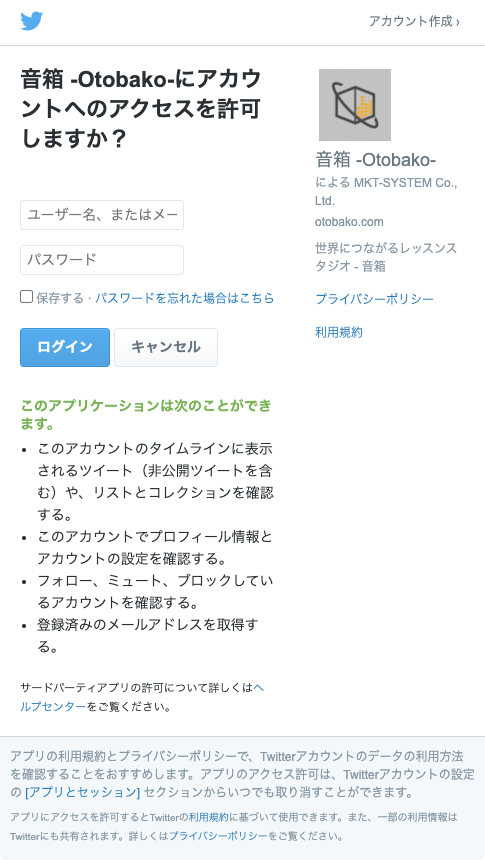

# ログイン

音箱は、SNSアカウントがあればどなたでもご利用いただけます。
対応しているSNSは次のとおりです。

- Google
- Facebook
- Twitter

（2020年10月現在）


ご利用のSNSに該当するログインボタンをクリックしてください。

```{admonition} 注意事項
:class: warning
SNSアカウント同士は紐づいておりません。音箱サービス上では別々のアカウントとして認識されます。例えば Google アカウントでログインして申し込みまたは作成したレッスンなどは、Facebookアカウントでログインしても確認できません。2回目以降は最初にログインしたSNSアカウントをご利用ください。
```

## 初回ログイン時の注意

初めてログインする場合やSNSの認証が切れている場合はSNSの認証画面が表示されます。SNSにログインした後、音箱サービスにログイン認証の許可を行ってください。

例：Twitter の場合



```{note}
音箱ではログインに使用したSNSアカウントを**勝手に利用することはありません**。ログインに必要な権限のみを取得しております。取得する権限については初回ログイン時に表示されますのでご確認の上、ご利用ください。
```

## ログアウト

ログインしている状態で上部に表示される自分のアイコンをクリックすると操作メニューが表示されます。操作メニューの一番下にある `ログアウト` をクリックしてください。


ログアウトが完了すると、ログイン画面に移動します。


